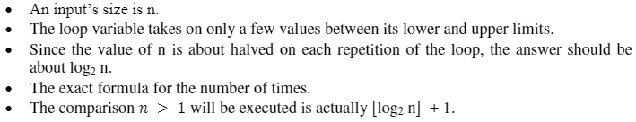

- **Euclid's GCD using Recursion**
  > Algorithm:
  > ```py
  > GCD(a,b) {
  >     if (b == 0){
  >         return a
  >     }
  >     else{
  >         GCD(b, a mod b)
  >     }
  > }
  > ```
  > Flow Chart:
  > ```mermaid
  > graph TD
  > START("Start") --> A["GCD#40;a, b#41;"] --> B{"is #40;b == 0#41; ?"} --True--> C(return a) --> STOP("Stop")
  > B --False--> D["GCD #40;b, a mod b#41;"] --recursive call--> A
  > ```

---

- **Euclid's GCD without using Recursion**
  > Algorithm:
  > ```py
  > while (b != 0){
  >     r = a mod b
  >     a = b
  >     b = r
  > }
  > return a
  > ```
  > Flow Chart:
  > ```mermaid
  > graph TD
  > START("Start") --> A{"while #40;b #33;= 0#41; ?"} --True--> B[r = a mod b \n a = b \n b = r] --> A
  > A --False--> C[return a] --> D("Stop")
  > ```

---

- **Mathematical Analysis of Recursive/Non-Recursive Algorithms (Problems)**
  > 
  > (1) Find the Time Complexity for the following Non-Recursive Algorithms:
  >
  >     (1.a) Finding the number of binary digits in a given integer:
  >```py
  >     INPUT n
  >     count = 0
  > 
  >     while (n > 1) {
  >       count++
  >       n = n / 2
  >     }
  >     return count
  >```
  >SOLUTION:
  >
  > 
  >
  >---
  >     (1.b) Finding the largest value from the given array:
  >```py
  >     INPUT n
  >     INPUT A[n]
  >     maxval = A[0]
  > 
  >        for (i = 1; i < n; i++) {
  >          if (A[i] > maxval) {
  >            maxval = A[i];
  >          }
  >        }
  >        return maxval
  >```
  >SOLUTION:
  >
  > 
  >
  >---
  > (2) Find the Time Complexity for the following Recursive Algorithm that finds the number of binary digits in a given integer:
  >```py
  >     INPUT n
  > 
  >     BinCountRecursive(n) {
  >       if (n == 0)
  >       {
  >         return 0
  >       }
  >       else {
  >         return BinCountRecursive(n/2) + 1
  >       }
  >     }
  >```
  >SOLUTION:
  >
  >```
  > The recurrence relation for the above algorithm is:
  > T(n) = T(n/2) + 1 , ∀ n>=1 --------> Eq.(1)
  > T(0) = 1, for n = 0
  >
  > Using Backward Substitution:
  > To find T(n/2), substitute n=n/2 in Eq.(1)
  > ∴ T(n/2) = T(n/2²) + 1
  > Similarly,
  > T(n/2²) = T(n/2³) + 1
  > T(n/2³) = T(n/2⁴) + 1
  > 
  > Now we substitute the value of T(n/2) in Eq.(1)
  > ∴ T(n) = [T(n/2²) + 1] + 1
  > => T(n) = T(n/2²) + 2 --------> Eq.(2)
  > Similarly, we substitute the value of T(n/2²) in the above Eq.(2)
  > T(n) = [T(n/2³) + 1] + 2
  > => T(n) = T(n/2³) + 3 --------> Eq.(3)
  > Again, for T(n/2³):
  > => T(n) = T(n/2⁴) + 4 --------> Eq.(4)
  >
  > Eq.(1), (2), (3), (4) follows a pattern: T(n) = T(n/2ᵏ) + k --------> Eq.(5)
  > So to find k, we equate n/2ᵏ with the recurrence relation's base condition
  > i.e. T(0) = 1
  > ∴ n/2ᵏ = 1
  > => n = 2ᵏ --------> Eq.(a)
  > Taking log on both sides:
  > ∴ logn = k log₂2
  > => k = logn --------> Eq.(b)
  >
  > So in Eq.(5) we can substitute n instead of 2ᵏ (∵ n = 2ᵏ from Eq.(a))
  > and logn instead of k (∵ k = logn from Eq.(b))
  > ∴ Eq.(5) becomes:
  > T(n) = T(1) + logn --------> Eq.(6)
  > We can manually find T(1) by substitution the value n = 1 in Eq.(1)
  > ∴ T(1) = T(⌊1/2⌋) + 1
  > => T(1) = T(0) + 1 (∵ T(⌊1/2⌋) = T(⌊0.5⌋) = T(0))
  > => T(1) = 1 + 1
  > => T(1) = 2
  > Now substituting the above T(1) value in Eq.(6)
  > ∴ T(n) = 2 + logn
  > => T(n) = O(logn)
  >
  > ∴ The Time Complexity for the given recurrence relation is O(logn)
  >```
  >---
