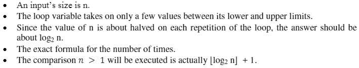
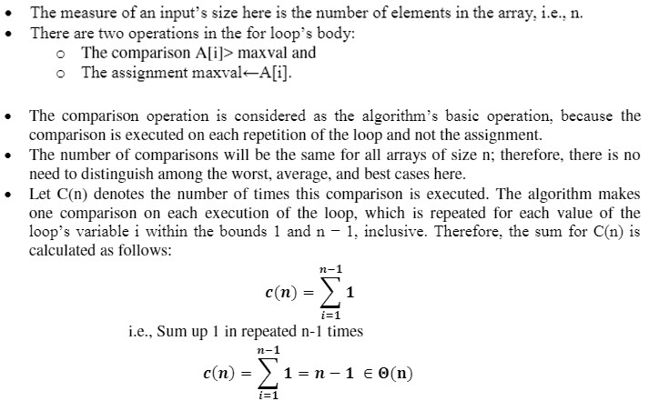

[<kbd>< ASSIGNMENTS</kbd>](../../README.md#assignments-qa)  
[<kbd> As. 2 ></kbd>](../a2/assignment_2.md)

---

- **Euclid's GCD using Recursion**
  > Algorithm:
  > ```py
  > GCD(a,b) {
  >     if (b == 0){
  >         return a
  >     }
  >     else{
  >         GCD(b, a mod b)
  >     }
  > }
  > ```
  > Flow Chart:
  > ```mermaid
  > graph TD
  > START("Start") --> A["GCD#40;a, b#41;"] --> B{"is #40;b == 0#41; ?"} --True--> C(return a) --> STOP("Stop")
  > B --False--> D["GCD #40;b, a mod b#41;"] --recursive call--> A
  > ```

---

- **Euclid's GCD without using Recursion**
  > Algorithm:
  > ```py
  > while (b != 0){
  >     r = a mod b
  >     a = b
  >     b = r
  > }
  > return a
  > ```
  > Flow Chart:
  > ```mermaid
  > graph TD
  > START("Start") --> A{"while #40;b #33;= 0#41; ?"} --True--> B[r = a mod b \n a = b \n b = r] --> A
  > A --False--> C[return a] --> D("Stop")
  > ```

---

- **Mathematical Analysis of Recursive/Non-Recursive Algorithms (Problems)**
  > 
  > (1) Find the Time Complexity for the following Non-Recursive Algorithms:
  >
  >     (1.a) Finding the number of binary digits in a given integer:
  >```py
  >     INPUT n
  >     count = 0
  > 
  >     while (n > 1) {
  >       count++
  >       n = n / 2
  >     }
  >     return count
  >```
  >SOLUTION:
  >
  > 
  >
  >---
  >     (1.b) Finding the largest value from the given array:
  >```py
  >     INPUT n
  >     INPUT A[n]
  >     maxval = A[0]
  > 
  >        for (i = 1; i < n; i++) {
  >          if (A[i] > maxval) {
  >            maxval = A[i];
  >          }
  >        }
  >        return maxval
  >```
  >SOLUTION:
  >
  > 
  >
  >---
  > (2) Find the Time Complexity for the following Recursive Algorithm that finds the number of binary digits in a given integer:
  >```py
  >     INPUT n
  > 
  >     BinCountRecursive(n) {
  >       if (n == 0)
  >       {
  >         return 0
  >       }
  >       else {
  >         return BinCountRecursive(n/2) + 1
  >       }
  >     }
  >```
  >SOLUTION:
  >
  >```
  > The recurrence relation for the above algorithm is:
  > T(n) = T(n/2) + 1
  >
  > We can apply the backward substitution technique to find the time complexity of this function:
  > 
  > T(n) = T(n/2) + 1
  > = T(n/2^2) + 1 + 1
  > = T(n/2^3) + 1 + 1 + 1
  > = ...
  > = T(n/2^k) + k
  > 
  > where k is the number of recursive calls required until the input size reaches 0.
  > 
  > When the input size reaches 0, the function returns a value of 0, which takes a constant time.
  > 
  > Therefore, the value of k can be found by solving the equation n/2^k = 0,
  > which gives k = log(n) base 2.
  > Reason:
  > n/2^k = 0; Multiplying both sides by 2^k, we get:
  > n = 0 * 2^k
  > Since anything multiplied by 0 is 0, we get:
  > n = 0
  > This is not possible since the input size of the function cannot be 0. Therefore, we can say that the base case of the recursion is reached when n/2^k = 1 (since 1 is the smallest possible input size for this function).
  > So, we have:
  > n/2^k = 1
  > Multiplying both sides by 2^k, we get:
  > n = 2^k
  > Taking the logarithm of both sides with base 2, we get:
  > log2(n) = log2(2^k)
  > Using the property that loga(b^c) = c*loga(b), we get:
  > log2(n) = k * log2(2)
  > Since log2(2) = 1, we get:
  > log2(n) = k
  > Therefore, we can say that the number of recursive calls required until the input size reaches 1 is log2(n) base 2.
  > 
  > Substituting the value of k in the equation for T(n), we get:
  > 
  > T(n) = T(n/2^k) + k
  > = T(1) + log(n) base 2
  > 
  > Since T(1) takes a constant time, the time complexity of the bincountrecursive(n) function can be represented as:
  > 
  > T(n) = log(n) base 2 + 1
  > 
  > ∴ The Time Complexity for the given recurrence relation is O(logn)
  >```
  >---
