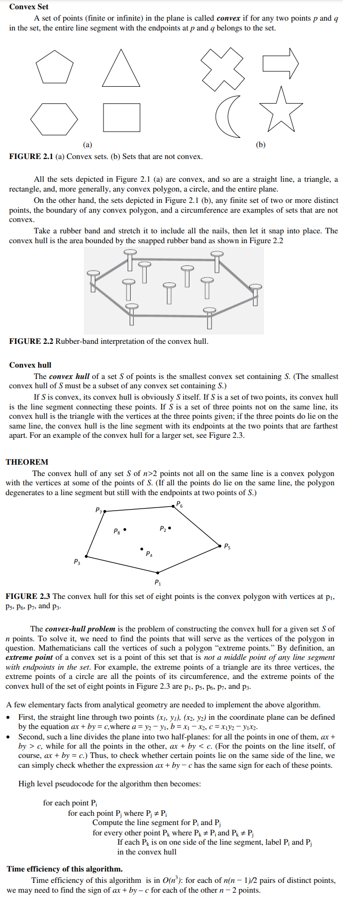
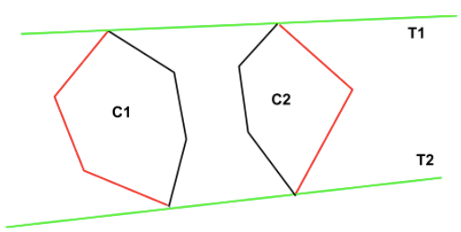
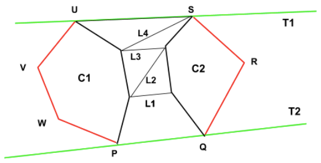
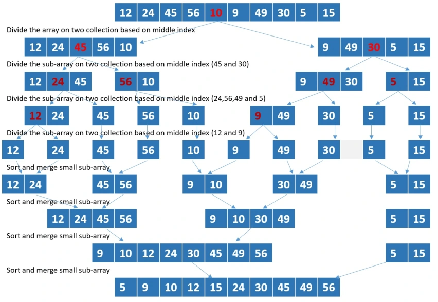
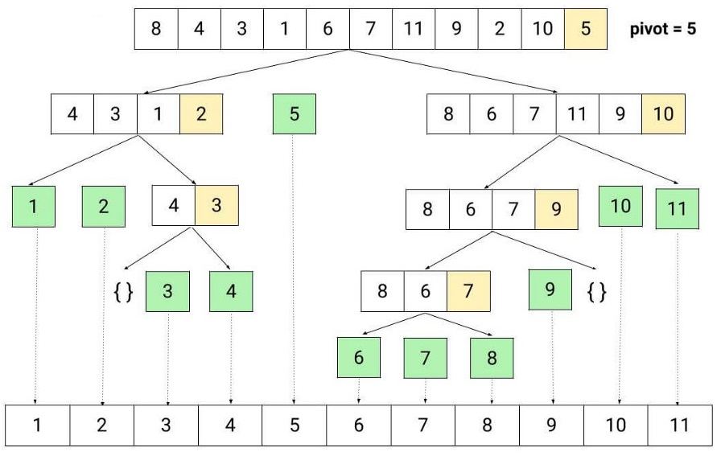

- **Convex Hull General Definition and Brute Force Approach**

  > 

---

- **Convex Hull Divide & Conquer Approach**

  Algorithm:
  > - Sort the vector containing points in ascending order (according to their x-coordinates).
  > - Divide the points into two halves S1 and S2. The set of points S1 contains the points to the left of the median, whereas the set S2 contains all the points that are right to the median.  
  > Find the convex hulls for the set S1 and S2 individually (Assuming the convex hull for S1 is C1, and for S2, it is C2).  
  > - Merge C1 and C2 and get overall convex hull C.

  Explanation:
  > - Two tangents of the left and the right convex hulls (C1 and C2) will make the final convex hull C.  
  > 
  > - The base case in the recursion will be when the number of points is less than or equal to 5 (i.e., n<=5); we will use the Brute-Force approach to find the solution.
  > - Finding the upper tangent and lower tangent:
  >    - Let L1 be the line that joins the rightmost point of the left convex hull C1 and the leftmost point of the right convex hull C2.
  >    - As L1 passes through the polygon C2, we take the anti-clockwise next point on C2 and label the line L2. The line is above the polygon C2, but it crosses the polygon C1, so we move to the clockwise next point, making the line L3. This again crosses the left polygon, so we move to line L4. This line is crossing the right polygon, so we move to line L5. Now, this final line is crossing neither of the points. Hence we get the upper tangent for the given two convex hulls.
  >   - For finding the lower tangent, we need to move inversely through the hulls, i.e., if the line is crossing the convex hull C2, we move to clockwise next and to anti-clockwise next if the line is crossing the convex hull C1
  >   - For finding the lower tangent:  
            we need to move inversely through the hulls, i.e., if the line is crossing the convex hull C2, we move to clockwise next and to anti-clockwise next if the line is crossing the convex hull C1  
  >   
  > - Here, **PQRSUVW** is the convex hull of the set of given points.  

---

- **Merge Sort Step Wise Execution Visualization**

  > 

---

- **Quick Sort Step Wise Execution Visualization**

  > 

---

- **Time and Space Complexity of Merge Sort**

  T(n) of Merge Sort:
    > - Recurrence Relation for Merge Sort Algorithm: **T(n) = 2T(n/2) + n**  
    > We start with the base case: **T(1) = 0** (sorting an array of size 1 takes no time)  
    > - Substitute n/2 for n in the equation:  
    > T(n/2) = 2T(n/4) + n/2  
    > We can substitute this expression into the original recurrence relation:  
    > T(n) = 2(2T(n/4) + n/2) + n  
    > = 4T(n/4) + 2n  
    > Substituting n/4 for n in the equation, we get:  
    > T(n/4) = 2T(n/8) + n/4  
    > Substituting this into the previous equation, we get:  
    > T(n) = 4(2T(n/8) + n/4) + 2n  
    > = 8T(n/8) + 3n  
    >
    > - We can see that the pattern is:  
    > T(n) = 2^k T(n/2^k) + kn  
    > When n/2^k = 1, we have k = logn, so:  
    > T(n) = 2^logn T(1) + nlogn =  nlogn  
    > - ∴ Merge Sort's **T(n) = O(nlogn)**.  

  S(n) of Merge Sort:
    > - Merge Sort requires a temporary array to hold the values during the merging process. The size of the temporary array is the same as the size of the original array being sorted.
    > - Thus, the space complexity is directly proportional to the size of the input array. In addition, Merge Sort is a recursive algorithm and each recursive call creates a new stack frame, which takes up additional space on the stack. However, the number of stack frames is limited to **O(log n)**, where n is the size of the input array.
    > - ∴ the **S(n)** of Merge Sort is **O(n)** for the temporary array + **O(logn)** for the stack space, which simplifies to **O(n)**, i.e. **S(n) = O(n) + O(logn) = O(n)**

---

- **Time and Space Complexity of QuickSort**

  T(n) of Quick Sort:
    > [Analysis of quick sort - Youtube](https://www.youtube.com/watch?v=3Bbm3Prd5Fo&t=159s)

  S(n) of Quick Sort:
    > - Quick Sort's **S(n)** is **O(log n)** in the **worst case** cause being a Recursive algorithm that sorts an input array by partitioning it into smaller sub-arrays, each recursive call to Quick Sort requires additional space on the stack to keep track of the sub-arrays being sorted.
    > - In the worst case, the input array is already sorted, and the pivot element chosen for partitioning is either the largest or the smallest element in the array. In this case, each recursive call will only reduce the size of the array by one, leading to a maximum depth of the recursive stack of **O(n)**.
    > - The space required for the stack in the worst case is **O(n)**, but due to the **logarithmic** decrease in the size of the sub-arrays being sorted, the space complexity is **O(logn)** on **average**.
    > - However, in the **best case** when the partitioning is balanced, the space complexity is **O(logn)** as well, as each recursive call will reduce the size of the array by half.

---

- **Matrix Multiplication using Strassen's Algorithm**

  <ins>Given:</ins>  

  $A=\left[\begin{array}{llll}2 & 1 & 3 & 4 \\ 4 & 3 & 1 & 2 \\ 1 & 4 & 2 & 3 \\ 3 & 2 & 4 & 1\end{array}\right] B=\left[\begin{array}{cccc}5 & 10 & 2 & 3 \\ 3 & 5 & 2 & 10 \\ 1 & 10 & 5 & 3 \\ 2 & 3 & 5 & 10\end{array}\right]$

$$
A = \begin{bmatrix}
    2 & 1 & 3 & 4 \\
    4 & 3 & 1 & 2 \\
    1 & 4 & 2 & 3 \\
    3 & 2 & 4 & 1
\end{bmatrix}
\qquad
B = \begin{bmatrix}
    5 & 10 & 2 & 3 \\
    3 & 5 & 2 & 10 \\
    1 & 10 & 5 & 3 \\
    2 & 3 & 5 & 10
\end{bmatrix}
$$

---