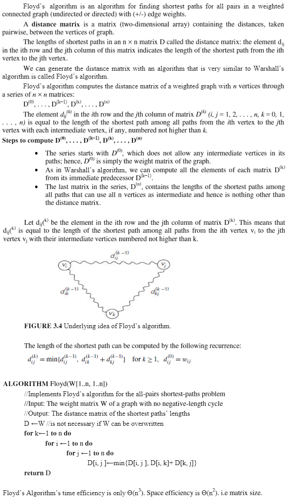
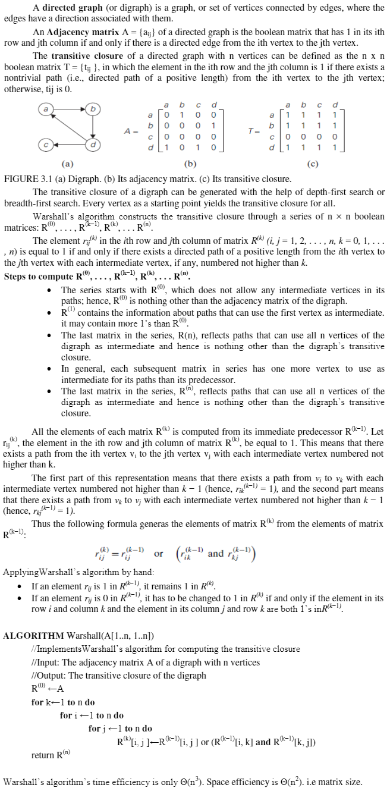
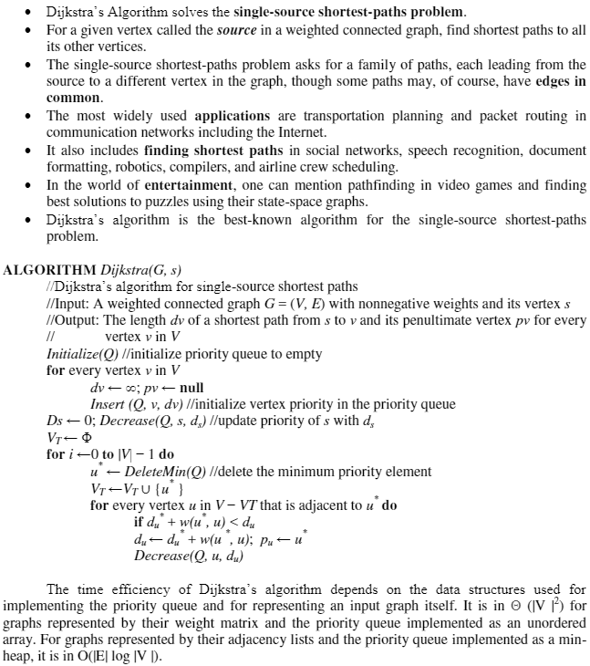

[<kbd>< ASSIGNMENTS</kbd>](../../README.md#assignments-qa)  
[<kbd>< As. 2</kbd>](../a2/assignment_2.md)
[<kbd> As. 4 ></kbd>](../a4/assignment_4.md)

---

1. (a) Explain:  
- **Floyd's**  
- **Warshall's**  &
- **Dijikstra's**  Algorithm

(b) Also apply each algorithm for the given graph:

>```mermaid
>flowchart LR
>A((1)) --6--> C((3))
>A --6--> B((2))
>B --2--> C((3))
>B --10--> D((4))
>C --3--> B
>C --12--> D
>D --1--> A
>D --6--> A
>```

<!-- <details>
<summary style="font-weight: bold;">Solution:</summary> -->

1.(a)  
- **Floyd's Algorithm:**  


- **Warshall's Algorithm:**  


- **Dijkstra's Algorithm:**  


1.(b)  

> **Note**  
> **ONLY INTERMEDIARY, FINAL SOLUTION & FORMULAS ARE PRESENT, NOT THE INTERMEDIARY STEPS**  

- using **Floyd's:**  

$d_{ij}^{(k)} = \begin{cases} w_{ij}, &\text{if } k = 0 \\ \min \left(d_{ij}^{(k-1)}, d_{ik}^{(k-1)} + d_{kj}^{(k-1)} \right), &\text{if } k \geq 1 \end{cases}$

initially, $d^{(0)}$ denotes the adjacency matrix of the given graph, i.e.  

$$
d^{(0)} = \begin{bmatrix} 
      & 1 & 2 & 3 & 4 \\
    1 & 0 & 6 & 6 & \infty \\
    2 & \infty & 0 & 2 & 10 \\
    3 & \infty & 3 & 0 & 12 \\
    4 & 1 & \infty & \infty & 0
    \end{bmatrix}
$$

to find $d_{ij}^{(1)}$, where $k = 1$, $i = 1$ and $j = 2,3,4$,  
we need not recalculate $ith$ row and $ith$ column i.e.,
in this case since $i = 1$ we don't need to calculate $d_{i,1}^{(1)}$, $d_{1,j}^{(1)}$ and write the same values as we got in $d_{i,1}^{(0)}$ and $d_{1,j}^{(0)}$. And also place $0's$ where $i=j$.

Therefore, the matrix $d^{(1)}$ will be partially filled as follows:

$$
d^{(1)} = \begin{bmatrix} 
      & 1 & 2 & 3 & 4 \\
    1 & 0 & 6 & 6 & \infty \\
    2 & \infty & 0 &  &  \\
    3 & \infty &  & 0 &  \\
    4 & 1 &  &  & 0
    \end{bmatrix}
$$

So the values we need to find are $d_{2,3}^{(1)}$, $d_{2,4}^{(1)}$, $d_{3,2}^{(1)}$, $d_{3,4}^{(1)}$, $d_{4,2}^{(1)}$, $d_{4,3}^{(1)}$,

We use the formula: $d_{ij}^{(k)} = \min \left(d_{ij}^{(k-1)}, d_{ik}^{(k-1)} + d_{kj}^{(k-1)} \right)$, to find all unknown values of $d_{ij}^{(1)}$

So for $d_{2,3}^{(1)} = \min \left(d_{2,3}^{(1-1)}, d_{2,1}^{(1-1)} + d_{1,3}^{(1-1)} \right) = \min \left(d_{2,3}^{(0)}, d_{2,1}^{(0)} + d_{1,3}^{(0)} \right) = \min \left(2, \infty + 6 \right) = \min \left(2, \infty \right) = 2$  
$\therefore$ $d_{2,3}^{(1)} = 2$.  
Similarly we find $d_{2,4}^{(1)}$, $d_{3,2}^{(1)}$, $d_{3,4}^{(1)}$, $d_{4,2}^{(1)}$, $d_{4,3}^{(1)}$, and end up with the following $d^{(1)}$ matrix:

$$
d^{(1)} = \begin{bmatrix} 
      & 1 & 2 & 3 & 4 \\
    1 & 0 & 6 & 6 & \infty \\
    2 & \infty & 0 & 2 & 10 \\
    3 & \infty & 3 & 0 & 12 \\
    4 & 1 & 7 & 7 & 0
    \end{bmatrix}
$$

Similary we find $d^{(2)}$ $d^{(3)}$, $d^{(4)}$ since there are 4 vertices in the given graph.  

partially filled $d^{(2)}$ will be:

$$
 d^{(2)}= \begin{bmatrix} 
      & 1 & 2 & 3 & 4 \\
    1 & 0 & 6 &  &  \\
    2 & \infty & 0 & 2 & 10 \\
    3 &  & 3 & 0 &  \\
    4 &  & 7 &  & 0
    \end{bmatrix}
$$

So the intermediary and final solution of the given graph are:  

$$
 d^{(2)}= \begin{bmatrix} 
      & 1 & 2 & 3 & 4 \\
    1 & 0 & 6 & 6 & 16 \\
    2 & \infty & 0 & 2 & 10 \\
    3 & \infty & 3 & 0 & 12 \\
    4 & 1 & 7 & 7 & 0
    \end{bmatrix}
$$

$$
 d^{(3)}= \begin{bmatrix} 
      & 1 & 2 & 3 & 4 \\
    1 & 0 & 6 & 6 & 16 \\
    2 & \infty & 0 & 2 & 10 \\
    3 & \infty & 3 & 0 & 12 \\
    4 & 1 & 7 & 7 & 0
    \end{bmatrix}
$$

$$
 d^{(4)}= \begin{bmatrix} 
      & 1 & 2 & 3 & 4 \\
    1 & 0 & 6 & 6 & 16 \\
    2 & 11 & 0 & 2 & 10 \\
    3 & 13 & 3 & 0 & 12 \\
    4 & 1 & 7 & 7 & 0
    \end{bmatrix}
$$

Therefore, $d^{(4)}$ denotes the shortest path distances between all pairs of vertices for the given graph.

<!-- </details> -->

---

2. (a) Explain **Optimal Binary Search Tree**  
   (b) Apply the OBST Algorithm for the given keys:
    >|Key|A|B|C|D|
    >|:-:|:-:|:-:|:-:|:-:|
    >|**P(K)**|0.1|0.2|0.4|0.3|

---
