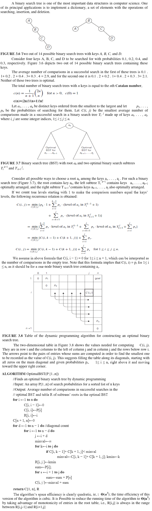
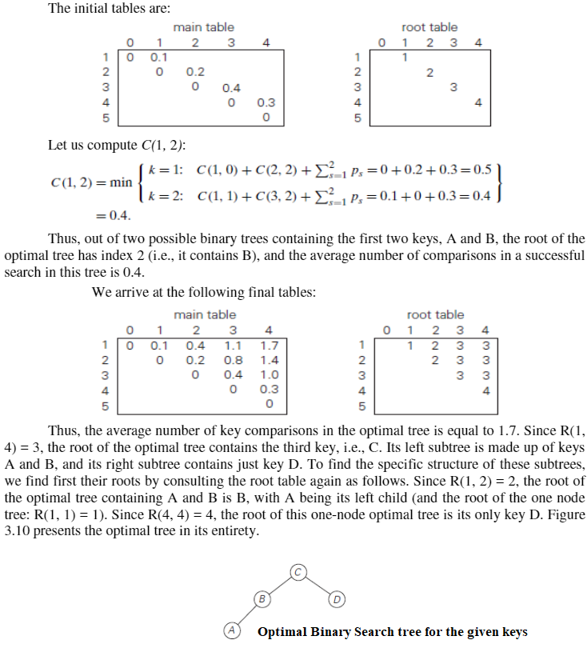

[<kbd>< ASSIGNMENTS</kbd>](../../README.md#assignments-qa)  
[<kbd>< As. 2</kbd>](../a2/assignment_2.md)
[<kbd> As. 4 ></kbd>](../a4/assignment_4.md)

---

1. (a) Explain:  
- **Floyd's**  
- **Warshall's**  &
- **Dijikstra's**  Algorithm

(b) Also apply each algorithm for the given graph:

>```mermaid
>flowchart LR
>A((1)) --6--> C((3))
>A --6--> B((2))
>B --2--> C((3))
>B --10--> D((4))
>C --3--> B
>C --12--> D
>D --1--> A
>D --6--> A
>```

1.(a)  
- **Floyd's Algorithm:**  


- **Warshall's Algorithm:**  


- **Dijkstra's Algorithm:**  


1.(b)  

> **Note**  
> **ONLY INTERMEDIARY, FINAL SOLUTION & FORMULAS ARE PRESENT, NOT THE INTERMEDIARY STEPS**  

- <ins>using **Floyd's:**</ins>  

$d_{ij}^{(k)} = w_{ij}$, if $k = 0$

$d_{ij}^{(k)} = \min \left(d_{ij}^{(k-1)}, d_{ik}^{(k-1)} + d_{kj}^{(k-1)} \right)$, if $k \geq 1$


initially, $d^{(0)}$ denotes the adjacency matrix of the given graph, i.e.  

$$
d^{(0)} = \begin{bmatrix} 
      & 1 & 2 & 3 & 4 \\
    1 & 0 & 6 & 6 & \infty \\
    2 & \infty & 0 & 2 & 10 \\
    3 & \infty & 3 & 0 & 12 \\
    4 & 1 & \infty & \infty & 0
    \end{bmatrix}
$$

to find $d_{ij}^{(1)}$, where $k = 1$, $i = 1$ and $j = 2,3,4$,  
we need not recalculate $ith$ row and $ith$ column i.e.,
in this case since $i = 1$ we don't need to calculate $d_{i,1}^{(1)}$, $d_{1,j}^{(1)}$ and write the same values as we got in $d_{i,1}^{(0)}$ and $d_{1,j}^{(0)}$. And also place $0's$ where $i=j$.

Therefore, the matrix $d^{(1)}$ will be partially filled as follows:

$$
d^{(1)} = \begin{bmatrix} 
      & 1 & 2 & 3 & 4 \\
    1 & 0 & 6 & 6 & \infty \\
    2 & \infty & 0 &  &  \\
    3 & \infty &  & 0 &  \\
    4 & 1 &  &  & 0
    \end{bmatrix}
$$

So the values we need to find are $d_{2,3}^{(1)}$, $d_{2,4}^{(1)}$, $d_{3,2}^{(1)}$, $d_{3,4}^{(1)}$, $d_{4,2}^{(1)}$, $d_{4,3}^{(1)}$,

We use the formula: $d_{ij}^{(k)} = \min \left(d_{ij}^{(k-1)}, d_{ik}^{(k-1)} + d_{kj}^{(k-1)} \right)$, to find all unknown values of $d_{ij}^{(1)}$

So for $d_{2,3}^{(1)} = \min \left(d_{2,3}^{(1-1)}, d_{2,1}^{(1-1)} + d_{1,3}^{(1-1)} \right) = \min \left(d_{2,3}^{(0)}, d_{2,1}^{(0)} + d_{1,3}^{(0)} \right) = \min \left(2, \infty + 6 \right) = \min \left(2, \infty \right) = 2$  
$\therefore$ $d_{2,3}^{(1)} = 2$.  
Similarly we find $d_{2,4}^{(1)}$, $d_{3,2}^{(1)}$, $d_{3,4}^{(1)}$, $d_{4,2}^{(1)}$, $d_{4,3}^{(1)}$, and end up with the following $d^{(1)}$ matrix:

$$
d^{(1)} = \begin{bmatrix} 
      & 1 & 2 & 3 & 4 \\
    1 & 0 & 6 & 6 & \infty \\
    2 & \infty & 0 & 2 & 10 \\
    3 & \infty & 3 & 0 & 12 \\
    4 & 1 & 7 & 7 & 0
    \end{bmatrix}
$$

Similary we find $d^{(2)}$ $d^{(3)}$, $d^{(4)}$ since there are 4 vertices in the given graph.  

partially filled $d^{(2)}$ will be:

$$
 d^{(2)}= \begin{bmatrix} 
      & 1 & 2 & 3 & 4 \\
    1 & 0 & 6 &  &  \\
    2 & \infty & 0 & 2 & 10 \\
    3 &  & 3 & 0 &  \\
    4 &  & 7 &  & 0
    \end{bmatrix}
$$

So the intermediary and final solution for the given graph are:  

$$
 d^{(2)}= \begin{bmatrix} 
      & 1 & 2 & 3 & 4 \\
    1 & 0 & 6 & 6 & 16 \\
    2 & \infty & 0 & 2 & 10 \\
    3 & \infty & 3 & 0 & 12 \\
    4 & 1 & 7 & 7 & 0
    \end{bmatrix}
$$

$$
 d^{(3)}= \begin{bmatrix} 
      & 1 & 2 & 3 & 4 \\
    1 & 0 & 6 & 6 & 16 \\
    2 & \infty & 0 & 2 & 10 \\
    3 & \infty & 3 & 0 & 12 \\
    4 & 1 & 7 & 7 & 0
    \end{bmatrix}
$$

$$
 d^{(4)}= \begin{bmatrix} 
      & 1 & 2 & 3 & 4 \\
    1 & 0 & 6 & 6 & 16 \\
    2 & 11 & 0 & 2 & 10 \\
    3 & 13 & 3 & 0 & 12 \\
    4 & 1 & 7 & 7 & 0
    \end{bmatrix}
$$

Therefore, $d^{(4)}$ denotes the shortest path distances between all pairs of vertices for the given graph.

- <ins>using **Warshall's:**</ins>  

$r_{ij}^{(k)} = r_{ij}^{(k-1)} \lor (r_{ik}^{(k-1)} \land r_{kj}^{(k-1)})$

For the given graph $r^{(0)}$ denotes the adjacency boolean, i.e.,  
For eg: if a path from vertex $i$ to $j$ exists we denote it as **1** or else **0**.  
Also Diagonal elements should be 1 since each vertex can be visited by itself.

$$
\therefore r^{(0)} = \begin{bmatrix} 
      1 & 1 & 1 & 0 \\
      0 & 1 & 1 & 1 \\
      0 & 1 & 1 & 1 \\
      1 & 0 & 0 & 1
    \end{bmatrix}
$$

To find out the transitive closure of the given graph without using the formula we can make use of floyd's solution that we found already ($d^{(1)}$, $d^{(2)}$, $d^{(3)}$, $d^{(4)}$). To find $r^{(1)}$, $r^{(2)}$, $r^{(3)}$, $r^{(4)}$:  

- Places where we have infinity($\infty$) in the floyd's matrix we can place $0$ as a boolean value
- Places where we have a value greater than $0$ we place boolean $1$.
- Diagonal Elements where $i = j$ should have the boolean value $1$ and this is because every vertex in a graph is trivially reachable from itself.

For finding $r^{(1)}$ we make use of $d^{(1)}$
So,

$d^{(1)} \rightarrow r^{(1)} \Rightarrow$

$$
\begin{bmatrix} 
      0 & 6 & 6 & \infty \\
      \infty & 0 & 2 & 10 \\
      \infty & 3 & 0 & 12 \\
      1 & 7 & 7 & 0
    \end{bmatrix} \rightarrow \left[\begin{array}{ll}
      1 & 1 & 1 & 0 \\
      0 & 1 & 1 & 1 \\
      0 & 1 & 1 & 1 \\
      1 & 1 & 1 & 1
\end{array}\right] \\
$$

$$
\therefore r^{(1)} = \begin{bmatrix} 
      1 & 1 & 1 & 0 \\
      0 & 1 & 1 & 1 \\
      0 & 1 & 1 & 1 \\
      1 & 1 & 1 & 1
    \end{bmatrix}
$$

Similarly we find $r^{(2)}$, $r^{(3)}$, $r^{(4)}$ and end up with the following matrices:

$$
r^{(2)} = \begin{bmatrix} 
      1 & 1 & 1 & 1 \\
      0 & 1 & 1 & 1 \\
      0 & 1 & 1 & 1 \\
      1 & 1 & 1 & 1
    \end{bmatrix}
$$

$$
r^{(3)} = \begin{bmatrix} 
      1 & 1 & 1 & 1 \\
      0 & 1 & 1 & 1 \\
      0 & 1 & 1 & 1 \\
      1 & 1 & 1 & 1
    \end{bmatrix}
$$

$$
r^{(4)} = \begin{bmatrix} 
      1 & 1 & 1 & 1 \\
      1 & 1 & 1 & 1 \\
      1 & 1 & 1 & 1 \\
      1 & 1 & 1 & 1
    \end{bmatrix}
$$

Hence for the given graph each and every vertex $j$ can be visited from any vertex $i$ without or via vertex $k$.

- <ins>using **Dijkstra's:**</ins>  
**Considering the Source to be vertex 1, and destination as vertex 4.**
Using the following table we can find out the shortest path's cost and backtrack to find the shortest path:

|$V$|$1$|$2$|$3$|$4$|
|:-:|:-:|:-:|:-:|:-:|
|$1$ (source)|<kbd style="font-weight:bold;">0₁</kbd>|6₁|6₁|$\infty$|
|$3$|$-$|6₁|<kbd style="font-weight:bold;">6₁</kbd>|18₃|
|$2$|$-$|<kbd style="font-weight:bold;">6₁</kbd>|$-$|16₂|
|$4$ (destination)|$-$|$-$|$-$|<kbd style="font-weight:bold;">16₂</kbd> (shortest path's cost)|

₂₃₄

Explanation:
- To find the shortest path's cost:
- First we take the source vertex $1$ in the first row and place $0$ in the 1st row, 1st column and place the value 1 as a subscript to the value 0 (0₁) which denotes that the value 0 is obtained via the recently traversed vertex 1 and mark the value so that no further changes need to be done to it or for the other bottom columns.
- Then save each of the edge cost from vertex 1 to other vertices i.e., from vertex 1 to 2, the edge cost is 6, so we add it with the marked value which is 0. And since this is the first iteration we don't have previous columns to compare whether we obtained a short path already, but in that case we need to select the minimum among them. We need add the newly found path to the marked value that is present in that specific row and compare it with the previous column value and save the shortest among them in the new cell.
- If a vertex is not directly reachable or not adjacent, place $\infty$ in that cell.
- Now out all the values found for the column vertex 1 we need to find which one is the smallest(excluding the marked value ). Next that value has to be copied(along with the subscript) in the very next column and name the row as the column's vertex where we got the minimum value. In that case we get the value to be 3(In this case we get 2 similar values 6 in both row 1, column 2 and row 1, column 3, but we select the second option).
- Again we perform the above steps until we find all the cell values.
- Now the 4th row, 4th column cell will contain the minimum cost to travel from vertex 1 to 4 which is 16.
- To find the shortest path:
- we need to look at the last value in the 4th row, 4th column i.e. 16₂ which means the value 16 is obtained when traversed through vertex 2. So the intermediate backtrack result would be 2 -> 4. Then we look at the marked value in row 2 which is 6₁, again which means the value 6 is obtained when traversed through vertex 1 and the resultant backtracked path would be: 1 -> 2 -> 4.
- Since we know that 1 is the source vertex we can stop backtracking and obtain the final shortest path
- Therefore the shortest path from vertex 1 to 4 is **1 -> 2 -> 4** with a travel cost of **16**.

---

2. (a) Explain **Optimal Binary Search Tree**  
   (b) Apply the OBST Algorithm for the given keys:
    >|Key|A|B|C|D|
    >|:-:|:-:|:-:|:-:|:-:|
    >|**P(K)**|0.1|0.2|0.4|0.3|

2.(a)  
- **Optimal Binary Search Tree:**  


2.(b)  


---
